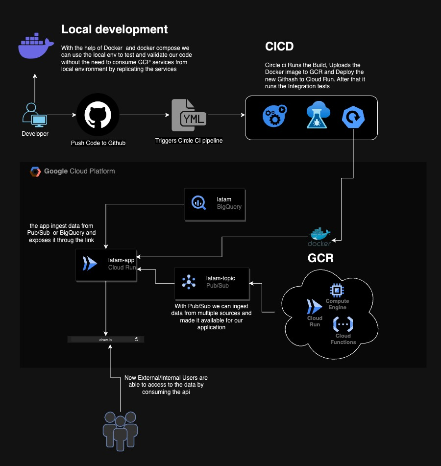

# latam-interview

#### Parte 1:Infraestructura e IaC

- [x] 1. Identificar la infraestructura necesaria para ingestar, almacenar y exponer datos:
	- [x] a. Utilizar el esquema Pub/Sub (no confundir con servicio Pub/Sub de Google) para ingesta de datos
	- [x] b. Base de datos para el almacenamiento enfocado en analítica de datos
	- [x] c. Endpoint HTTP para servir parte de los datos almacenados
- [x] 2. (Opcional) Deployar infraestructura mediante Terraform de la manera que más te acomode. Incluir código fuente Terraform. No requiere pipeline CI/CD.

#### Solucion
Basandome en la arquitectura de Pub/Sub ( https://ably.com/topic/pub-sub ) , se decidio usar en el Cloud Provider GCP (Google Cloud Platform) los servicios de Cloud Run (https://cloud.google.com/run/docs?hl=es-419 ), BigQuery(https://cloud.google.com/bigquery/docs/introduction?hl=es-419), Pub/Sub (https://cloud.google.com/pubsub/docs?hl=es-419) y Artifact Registry (https://cloud.google.com/artifact-registry/docs/transition/transition-from-gcr?hl=es-419), el codigo se encuentra en el directorio infrastructure

Adicionalmente se agregaron scripts de pre-commit para evaluar el codigo antes que se suba al repositorio, asi nos aseguramos que esten aptos en cuanto a los estandares de desarrollo. Se sugiere ademas implementar Snyk para poder escanear terraform para detectar vulnerabilidades en cuanto a configuraciones, asi como agregar un check para validar el formato de los commit messages para estar acorde a las conveciones establecidas por el equipo de ingenieria

#### Parte 2: Aplicaciones y flujo CI/CD
- [x] 1. API HTTP: Levantar un endpoint HTTP con lógica que lea datos de base de datos y los exponga al recibir una petición GET
- [x] 2. Deployar API HTTP en la nube mediante CI/CD a tu elección. Flujo CI/CD y ejecuciones deben estar visibles en el repositorio git.
- [ ] 3. (Opcional) Ingesta: Agregar suscripción al sistema Pub/Sub con lógica para ingresar los datos recibidos a la base de datos. El objetivo es que los mensajes recibidos en un tópico se guarden en la base de datos. No requiere CI/CD.
- [x] 4. Incluye un diagrama de arquitectura con la infraestructura del punto 1.1 y su interacción con los servicios/aplicaciones que demuestra el proceso end-to-end de ingesta hasta el consumo por la API HTTP

#### Solucion
Se ha creado una app usando NodeJS, que depende del entorno dev/prod escoge entre usar BigQuery o una db local, se creo una imagen de docker asi como un docker-compose para levantar los servicios necesarios para permitir a los desarolladores trabajar localmente sin depender directamente de los servicios en GCP. 

Se creo un Pipeline en Circle CI para poder hacer el Build, el push del contenedor construido al repositorio de imagenes en GCP, asi como al final hace el deploy en Cloud Run

#### Parte 3: Pruebas de Integración y Puntos Críticos de Calidad
- [x] 1. Implementa en el flujo CI/CD en test de integración que verifique que la API efectivamente está exponiendo los datos de la base de datos. Argumenta.
- [x] 2. Proponer otras pruebas de integración que validen que el sistema está funcionando correctamente y cómo se implementarían.
- [x] 3. Identificar posibles puntos críticos del sistema (a nivel de fallo o performance) diferentes al punto anterior y proponer formas de testearlos o medirlos (no implementar)
- [x] 4. Proponer cómo robustecer técnicamente el sistema para compensar o solucionar dichos puntos críticos

#### Solucion

Se agregaron tests de integracion que validan que dependiendo de las variables de entorno si va a utilizar ambiente local o de production(aplica tambien si queremos testear dev, qa o uat). Se hizo de esta forma para no tener que re-escribir pruebas. Se utilizo el framework de jest para validar la consulta de datos y el codigo de respuesta, pero este enfoque aplica para cualquier lenguaje que se decida usar bien sea python o cualquier otro.

Agregar los tests igual no es suficiente, se sugiere dependiendo del caso tambien agregar otro tipo de pruebas como lo son SAST, IAST y DAST (https://www.imperva.com/learn/application-security/sast-iast-dast/) . Adicional al codigo tambien es necesario asegurarse que las imagenes de Docker y el codigo de terraform sea escaneado para encontrar vulnerabilidades antes de que estas lleguen a produccion, asi se recomendo utilizar Snyk en el punto anterior, tambien es necesario que las imagenes de docker sean inmutables asi se evita si hay un acceso mal intencionado que una imagen sea re-escrita con algun malware. Hay muchas herramientas que sirven para estos casos como lo son Veracode, Kiuwan, SonarQube, Aquasec suite of tools, entre otros.

Es necesario tambien incluir QualityGates para asegurar que el coverage del codigo sea por lo general arriba del 90% pero depende del equipo de desarrollo, asi se asegura que el codigo desplegado ha sido testeado propiamente en su mayoria asegurando la calidad del trabajo realizado.

#### Parte 4: Métricas y Monitoreo

- [x] 1. Proponer 3 métricas (además de las básicas CPU/RAM/DISK USAGE) críticas para  entender la salud y rendimiento del sistema end-to-end
- [x] 2. Proponer una herramienta de visualización y describe textualmente qué métricas mostraría, y cómo esta información nos permitiría entender la salud del sistema para tomar decisiones estratégicas
- [x] 3. Describe a grandes rasgos cómo sería la implementación de esta herramienta en la nube y cómo esta recolectaría las métricas del sistema
- [x] 4. Describe cómo cambiará la visualización si escalamos la solución a 50 sistemas similares y qué otras métricas o formas de visualización nos permite desbloquear este escalamiento.
- [x] 5. Comenta qué dificultades o limitaciones podrían surgir a nivel de observabilidad de los sistemas de no abordarse correctamente el problema de escalabilidad

#### Solucion

- 1. Latency, Error rate y Throughput, estas a uno le permiten evaluar de mejor forma el rendimiento de una app, estas metricas se colectan a traves de un APM (https://www.techtarget.com/searchenterprisedesktop/definition/Application-monitoring-app-monitoring), existen muchos ejemplos de estos servicios como lo son Datadog, Dynatrace, Sentry, OpenTelemtry

- 2. Tengo preferencia por la combinacion Open Source que seria Thanos + Loki + Prometheus + Grafana + OpenTelemtry. Esto nos permitiria colectar la informacion de distintos puntos como lo serian logs, metricas de uso ya expuestas en el punto 1, con grafana nos permitiria tener la flexibiliad de crear distintos tipos de dashboards y segregar el acceso dependiendo el tipo de usuario que tengamos. 

- 3. La propuesta explicada en el punto anterior le permite a la empresa bajar los costos de almacenado de informacion al utilizar GCS o S3 para almacenar todas las metricas y logs de las aplicaciones, tienen flexibilidad a la hora de ingestar todos los logs y metricas ademas que la forma de consulta es muy intuitiva, no tendria que pagar por una aplicacion externa si no solo por el recurso de computo asociado a las instancias que colectan la data asi como el storage utizado que en el caso de nuestra infraestructura seria GCS. Este enfoque ahorra mucho mas para la empresa que utilizar herramientas como Datadog o Dynatrace

- 4. En cuanto al escalamiento, el enfoque propuesto le permite a uno escalar sin problemas y practicamente seria transparente a los usuarios, al ser opensource y manejar nosotros el almacenamiento y lifecycle de la data ingestada, no hay limite en cuanto al sistema ya que esta pensado precisamente para procesar una gran cantidad de informacion, provee redundancia entre sus componentes y aun si algun nodo cae hay otro que lo respalda. En cuanto a metrica desbloqueada.

- 5. En el caso que pueda estar mal configurado, o de algun componente no tener acceso directo al sistema de recoleccion por un periodo de tiempo, ahi entra el storage nativo del cloud provider, ya que el stack provee la capacidad de sincronizar los bloques de informacion con el storage directamente y luego sincornizar con la base de datos cuando se reestablesca la conexion, asi como se explico anteriormente si algun nodo del stack de monitoreo cae, esta diseñado para ser resiliente y siempre tendra al menos 2 nodos mas para seguir ingestando informacion.

#### Parte 5: Alertas y SRE (Opcional)

- [x] 1. Define específicamente qué reglas o umbrales utilizarías para las métricas propuestas, de manera que se disparan alertas al equipo al decaer la performance del sistema. Argumenta.
- [x] 2. Define métricas SLIs para los servicios del sistema y un SLO para cada uno de los SLIs. Argumenta por qué escogiste esos SLIs/SLOs y por qué desechaste otras métricas para utilizarlas dentro de la definición de SLIs.

#### Solucion

Tomando el ejemplo de la respuesta anterior en cuanto a metricas por evaluar, uno puede considerar que entre los SLI: 

Service uptime: Se tiene que procurar al menos tener un SLO de 99.9%, si bien esto en cuanto al desarollo constante de features (cada sprint) puede ser afectado por algun bug, este objetivo se puede lograr si el sistema se en cada etapa del desarollo si se sigue la filosofia de shif-left

ResponseTime: Es casi un esandarizado en la industria que se tiene que apuntar a tener respuestas en el menor tiempo posible, si bien esto varia en cada caso por usuario y que tipo de data busca, es normal que uno apunte a tener un romedio de 200-300ms en el rango de los 30 dias para no dar la impresion de que el sistema es lento

ErrorRate: El objetivo de este indicador es mantener bajo la cantidad de errores que pueda dar el sistema que pueda dar una mala experiencia a los usuarios. Lo ideal seria del 1% an 0,5% pero depende de muchos factores lograr ese numero, ahi diria que depende tambien de la calidad del codigo y los quality gates implementados durante el proceso de desarollo y los informes de code verage generado.
